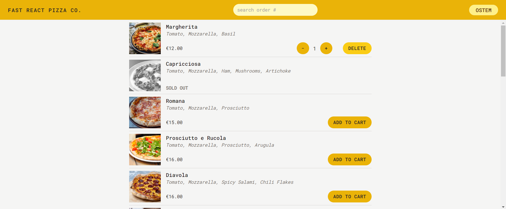

# Simple React Application utilizing the current React-Router functionalities and hooks.

This is a simple pizza-ordering application.

### Utilities used include 
- React-router
- Tailwind css
- React-Redux
- Redux toolkit

#### From react router we made use of the following features.

- createBrowserRouter
- RouterProvider
- Actions
- Loaders
- userFetcher
- useLoaderData
- useActionData
- useRouteError
- useNavigation

#### Sample image

The remaining images can be located [here](react-piza-ordering-app-img)